 

 

## 👋 About Me

- 🎓 Third-year **B.Tech CSE (AI/ML)** student, working toward a career as an **AI/ML Engineer**
- 🧠 On a hybrid Software + AI/ML path — LLMs, applied GenAI systems, and pipelines built to ship, not just notebooks to read
- 🛠️ Working through a structured 41-topic AI/ML roadmap, currently deep in **Classical ML**, alongside parallel DSA prep for interviews
- 🎯 Targeting AI/ML roles at Big Tech, AI-first startups, and product companies
- ⚡ Fun fact: I once spent longer fixing a Python-version mismatch while deploying a project than I did building the feature it was blocking — pinning **Python 3.12** won in the end

 

## 🧰 Tech Stack

**Languages**
 

  

**Frameworks & Libraries**
 

 

  

**Databases**
 

  

**Tools & Platforms**
 

 

## 📊 GitHub Stats

  
  

  

## 🏆 GitHub Trophies

  

 

## 📈 Contribution Activity

  

  

 

## 🚀 Featured Projects

### 📊 Feature Engineering Impact Analyzer
A Streamlit app that shows exactly how different feature engineering choices move the needle on model performance — deployed live so anyone can try it, not just read about it.

`Python` `Streamlit` `scikit-learn`

[🔗 Repository](https://github.com/sushantkumar31/feature-engineering-impact-analyzer) · [🌐 Live Demo](https://feature-engineering-impact-analyzer.streamlit.app/)

Also maintains <a href="https://github.com/sushantkumar31/leetcode-solutions">leetcode-solutions</a> (structured DSA practice) and <a href="https://github.com/sushantkumar31/myAIML">myAIML</a> (AI/ML learning notebooks).

 

## 🌱 Currently Learning

- 🧭 Working through a 41-topic AI/ML roadmap — currently deep in **Classical ML**
- 🧩 Two parallel DSA tracks for interview prep — currently on **Hashing** and **Graphs**
- 📜 Anthropic Academy, OpenAI Academy, Google AI Essentials, and AWS AI Practitioner Essentials
- 📈 Rounding out the full Kaggle Machine Learning track

 

## 📫 Let's Connect

